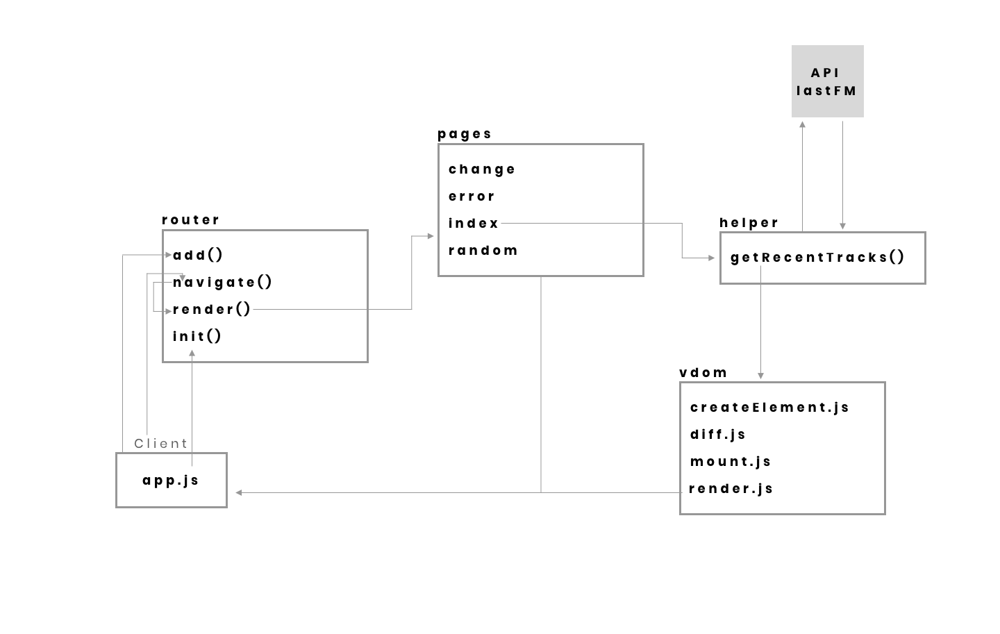

## The spotify experience

### Nice image here

### Table of contents

- Not yet done
-

### Concept

Making a small interface based on the LastFM API. It shows what I've listened to and you can possible click through artists etc. And track what i've listened too.

#### Diagram



### install

```js
Clone and open that index.html and enjoy, no builders needed
```

### Feature list

- Can fetch data from my user
- Hash router
- Virtual dom

### Api available data

- Under construction

### License

MIT

### The 'big' list of things I need to do

- [x] Making modules
- [ ] Diffent last FM users
- [ ] Make the time previous correctly not (4 feb. 18:39) but something like (5 minutes ago) etc.
- [ ] Previous, next buttons when page reloads don't need to be hiding
- [ ] Making a usefull router
- [ ] Dynamic routes
- [ ]

### Links I used

[Creating a virtual DOM](https://dev.to/ycmjason/building-a-simple-virtual-dom-from-scratch-3d05)
[The API](https://www.last.fm/api/show/user.getRecentTracks)
[Tagged template literals](https://wesbos.com/tagged-template-literals/)
